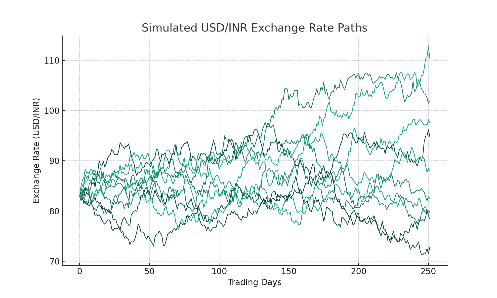

# USD/INR Exchange Rate Simulation

This project simulates the dynamics of the USD/INR exchange rate based on a stochastic differential equation derived from the book "Brownian Motion Calculus". The specific problem in reference is problem 4.10.8.

## Model

The exchange rate dynamics are modeled using a stochastic differential equation. The specifics of the equation are derived from the mentioned book, and for a clear representation, it's advisable to refer to problem 4.10.8 of the book.

## Simulation Results

The simulation was carried out with the following parameters:
- Initial exchange rate: 1 USD = 83 INR
- Drift rate: 1% annual appreciation of USD against INR
- Volatility: 15% annual volatility
- Time horizon: 1 year
- Time step: 1/252 (assuming 252 trading days in a year)

The results are visually represented in the plot provided in this repository.

## Usage

To run the simulation, execute the `exchange_rate_simulation.py` script.

## Reference

The dynamics and methodology are based on:
- Wiersema, Ubbo F. *Brownian Motion Calculus*. Wiley, 2008.

## License

MIT License.

